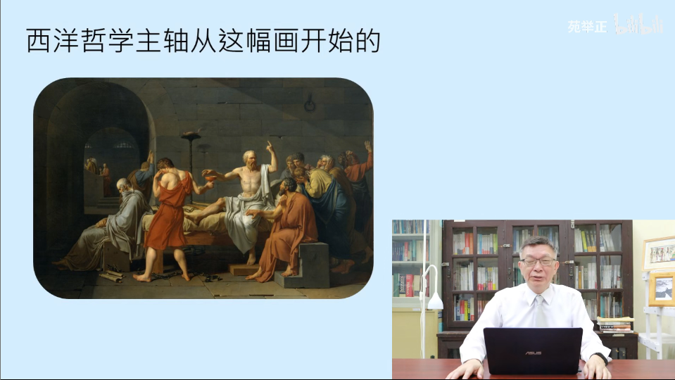
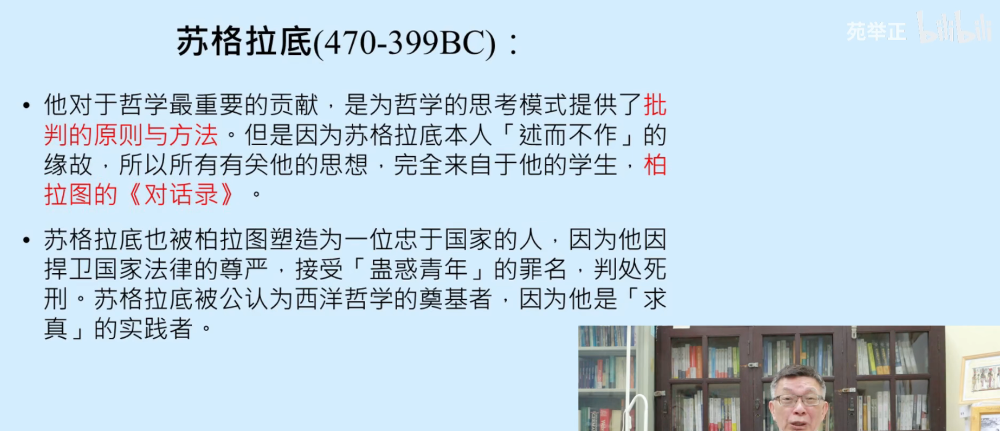
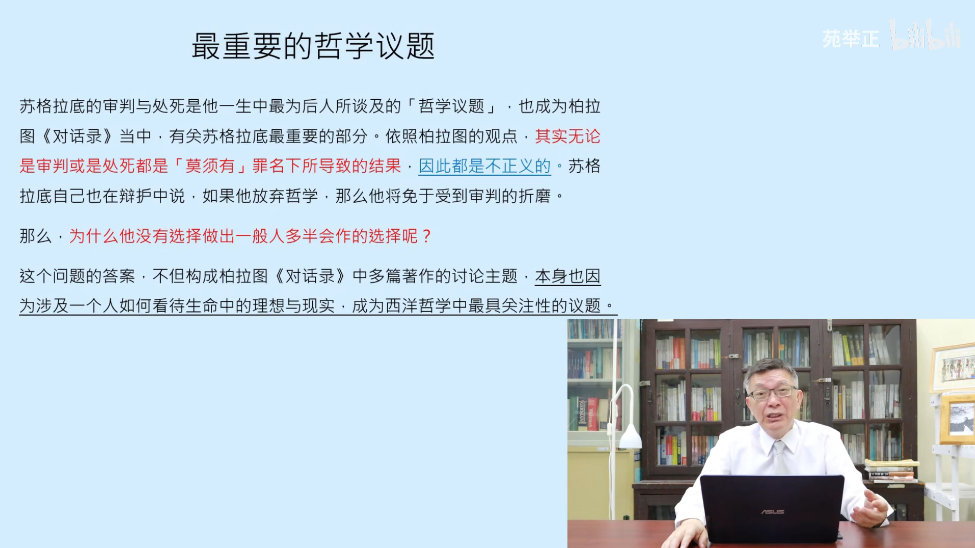
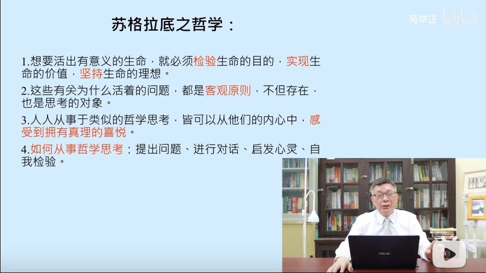

# 【苑举正】1.1 哲学是什么（上）——台湾大学哲学概论

**西方哲学的起源的三点核心思想：**

1. 人天生是哲学的动物
2. 哲学就是实践批判理性
3. 排除错误是贴近真理的方法

**人天生是哲学的动物：**

1. 人的天性中，包含喜爱发问的本能
2. 发问是不需要理由的
3. 随着社会化的成长，我们慢慢变得不爱发问了
4. 哲学就是鼓励重新发问的学问
5. 我们需要透过表达能力，来阐述我们的思想

**西方哲学的起源：**

1. 排除错误是贴近真理的方法
2. 真理在通过不断的否定虚假的过程中呈现，自我呈现，而这就是要给不断的否定虚假的过程
3. 在“获得真理的感觉”和“用语言表达真理”之间存在着落差
4. 透过语言：不断肯定与否定真理的方式，称之为 辩证的思维

**传统西方哲学的三种定义：**

1. 以辩证方法为主的西方哲学主轴
2. 以阅读哲学思想为主的哲学历史
3. 以提升人生价值为主的道德哲学

传统上来将，这三点是经常混在一起的，构成了西方哲学的传统。

现代哲学应为收到了科学的影响，所以引发了知识论与形而上学的问题，使得哲学的议题出现了根本的变化。

**西方哲学主轴从这幅画开始：**

人性的研究：

1. 苏格拉底的哲学意涵
	1. 改变自然哲学
	2. 回归人性本质
	3. 理想性格的知识分子
2. 苏格拉底不说哲学是什么，而是声称“一个未经检验的生命是不值得活的”

为什么是苏格拉底：

苏格拉底之死带来的哲学问题：

苏格拉底的哲学：

苏格拉底的反诘法：提问与回答

1. 四个重点：
	1. 提问的目的是什么？——进行对话交流
	2. 提问的意义是什么？——进行捍卫对抗
	3. 提问的效用是什么？——进行反讽启发
	4. 提问的结果是什么？——承认无知
2. 对话，捍卫与反讽之间的循环，构成学习的过程，其目的在于讨论表面与真实之间的差别
3. 哲学就是一个否定表面认知，探讨真实本质的活动

苏格拉底的人格是值得效仿的，苏格拉底也是哲学家的典范。

认识苏格拉底的四个线索：

1. 柏拉图：《辩护篇》
2. 色诺芬：《辩护篇》，《飨宴篇》和《记忆录》
3. 阿里斯托芬：戏剧《云》，《云》反映了诗人和哲学家的区别
4. 亚里士多德

苏格拉底也启发了犬儒主义学派，部分人认为苏格拉底是犬儒主义学派的创始人。

在苏格拉底之前还存在着先苏学派。

