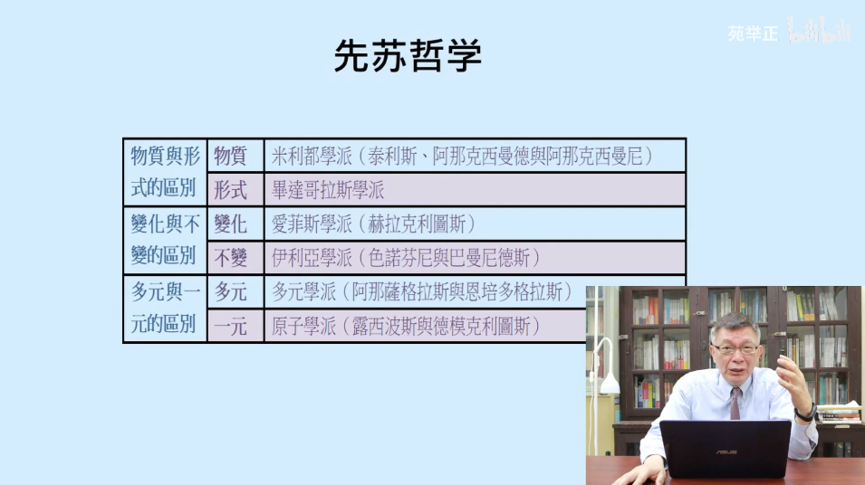
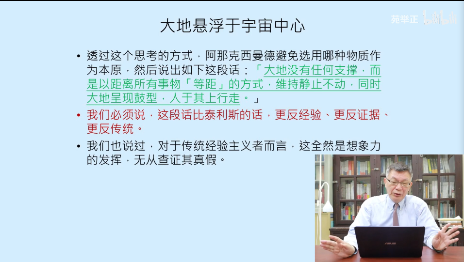
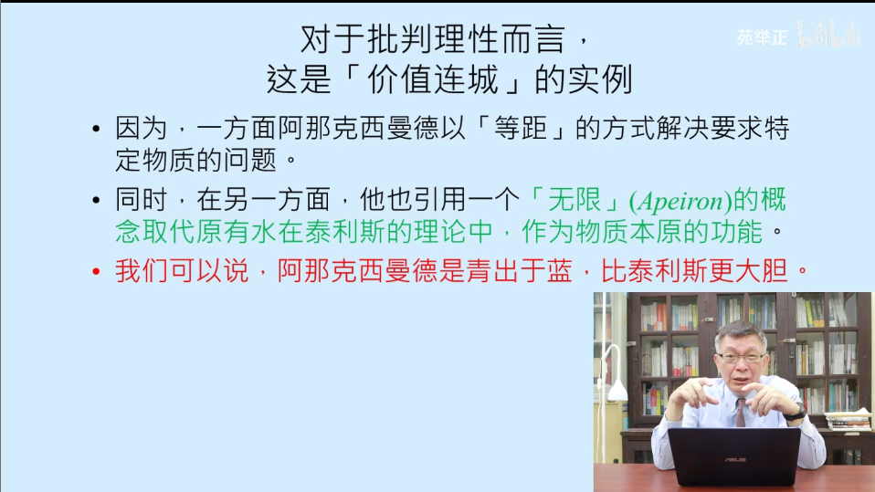

# 【苑举正】1 2 哲学是什么（下）——台湾大学哲学概论

**什么是先苏哲学：**

1. 先于苏格拉底的哲学
2. 也可以叫做自然哲学
3. 核心的问题：自然是什么所构成的
4. 苏格拉底的哲学，是以人伦为主，而不涉及自然的本质问题
5. 因为苏格拉底并不是继承与之前的哲学的脉络，所以以“先”作为区分

先苏哲学的主要六个学派：

米利都学派：

1. 三位哲学家：
	1. 泰利斯
	2. 阿那克西曼德
	3. 阿那克西曼尼
2. 三者为师徒关系

泰利斯：水是太初，而地像一个木筏，浮在水上

1. 为什么水是太初
2. 为什么一切物质都来自于水呢
3. 难道沙漠中的沙子，石头等都是来自于水呢
4. 为什么水具有这样的魔力呢
5. 为什么后人将这句话当成了哲学的起源呢（因为接受了哲学的批判）

水是一切的起源吗？

1. 首先这是一个大胆的猜测，同时也是一句断言
2. 断言会邀请批判，但是批判的结果必须是另一个断言，单纯的说这句话不为真是不能够增长我们的知识
3. 其次，有关什么是真的问题

阿那克西曼德收到了批评的邀请，进行了批评：水支撑了大地，那么是什么支撑了水呢？这样的追问可以导致无限后退，从而对于最终的支柱问题进行无穷的追问。

唯一的解决方法：发挥更加大胆的想象力，提出一个更加完整的理论：

该理论的优势：

科学的出现与哲学的起源：

1. 没有古希腊哲学这个由理论结合经验的传统，科学是不可能出现的
2. 这也是为什么先苏哲学的发展，成为了现代科学的许多启发，尤其是那些超出了经验的，缺乏了证据以及脱离传统的理论
