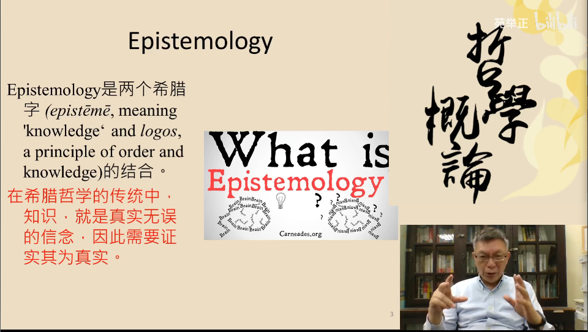
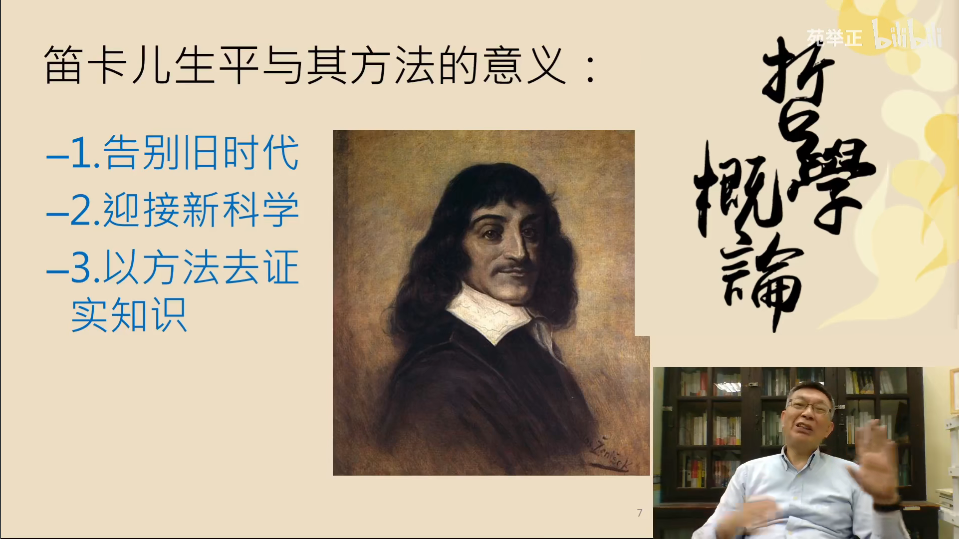
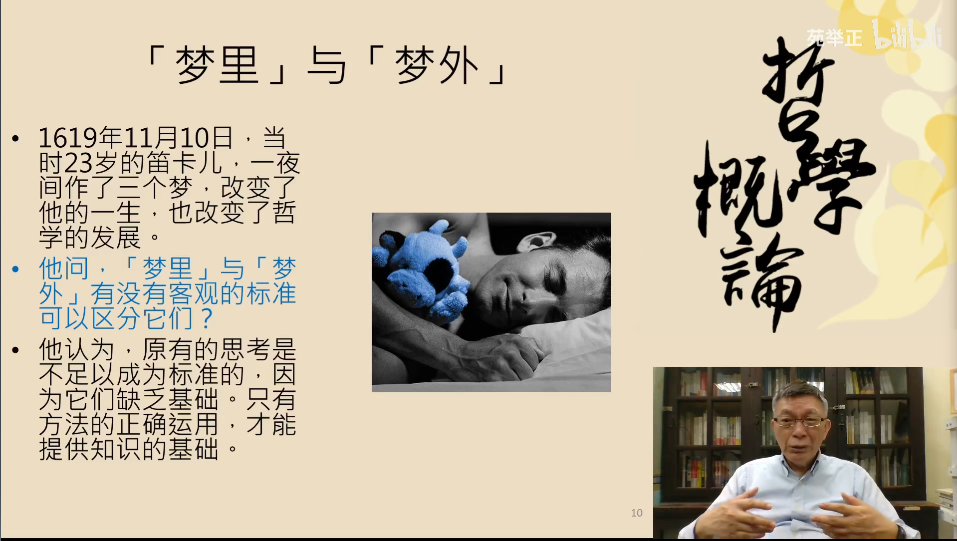
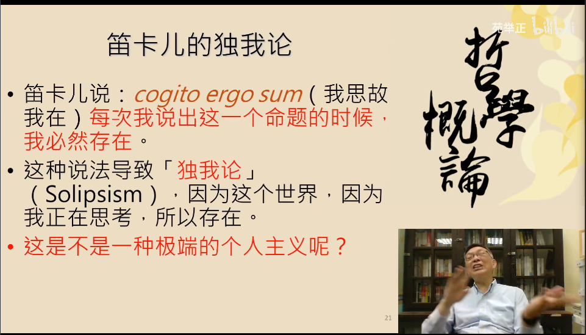

# 【苑举正】2.1 知识论（上）——台湾大学哲学概论

知识论的谈论范围：

1. 以历史性的发展为主
2. 主要是针对中世纪以后，在现代时期出现的欧陆理性主义与英国经验主义为主
3. 引用康德的观点，强调欧陆与英国在现代哲学发展出所出现的差异
4. 这些差异如何在康德的哲学这里结合在一起
5. 对抗：怀疑论

欧洲大陆：主要是理性主义：

1. 笛卡尔
2. 莱布尼兹
3. 斯宾诺莎

英国经验主义：

1. 洛克
2. 休谟
3. 乔治-贝克莱

康德：具有综合性的论述

知识论一词的由来：

知识论的轮廓：

1. 知识论是分析哲学，也就是英美哲学的主轴
2. 主要议题：如何拥有真实的知识。
3. 对于一般人而言，知识与信念不太区分，至少对于知识的真实性要求并不是绝对的。
4. 在哲学中，对于知识的要求，就是宣称拥有知识的人，要能够证成知识的真实性。
5. 议题的由来：柏拉图，“知识就是经过证实为真的信念”

证实：

1. 知识就是经过证实为真的信念的核心在于：证实
2. 知识的证实不是宣称，而是有证据的宣称
3. 我们在宣称拥有知识的过程中，会因为各式各样的理由，出现错误
4. 我们针对知识的宣称，可以合理地怀疑

自明的知识：

1. 在笛卡尔之前的哲学家，总是有一些事物是自明的（例：上帝的存在，自由的意志或者五官的感知）
2. 自明：这些事物的真实性不需要另外的证实，因为它们使得其他知识成为可能的基础
3. 笛卡尔的态度：反对任何形态的知识是自明的，无需检验的

笛卡尔：

以数学作为基础：

1. 笛卡尔在二十岁出头的时候：坚信能够以数学作为基础，发展出一个全新的科学系统
2. 笛卡尔自身无法完成这个任务，但是笛卡尔对于数学（解析几何）和物理（机械论）的贡献让笛卡尔成为了十七世纪科学论的佼佼者
3. 笛卡尔关心的议题：方法论，证成，确定性
4. 作品：《心灵指导原则》，试图建立一个能够让问题被严谨且无误探究的流程

笛卡尔——如何获得100%确定的知识：

1. 《哲学的第一沉思》提出问题：如何获得100%确定的知识
2. 该问题被广泛的讨论，以及引发了一系列的反对
3. 笛卡尔通过响应来扩充自己的论点，并且与他人展开了辩论

梦里与梦外：

笛卡尔认为：

1. 拒绝既定的现象
2. 拒绝确定的教条
3. 拒绝过去的权威
4. 个人只接受依个人理性验证为实的真理

笛卡尔的怀疑方法：

1. 运用理智，找出事物的方法：方法的目的在于发掘事物，找出它们，并且确定所找出的为真
2. 怀疑的方法：除非清晰的认知，否则不接受任何事物为真，甚至怀疑原有已经接受事物的真实性——这导致了知识论的转向
3. 调查的方法：找出事物并且加以确定为真的方法
4. 笛卡尔的目的：以一个什么都不知道的人为出发点，然后以其个人之智力来发掘与确定知识
5. 笛卡尔的怀疑对象：外在世界（感官可以被欺骗），个人存在，数学计算（计算的过程可能出错）
6. 笛卡尔认为不可怀疑的对象：我正在思考（我思故我在）——这也可以被认为是西方个人主义的起源

笛卡尔的结论：知道我们能够证明自然存在，我们无法对自然的内容作出任何程度的调查。

笛卡尔的知识论是：

1. 我们能够知道什么的研究
2. 我们思考的规则
3. 我们知识的限制
4. 确定知识为真的标准=绝对的确定性
5. 没有任何适当的证实可以赋予我们对外在世界抱持的信念
6. 怀疑论的目的：不在于劝阻我们相信，而在于将注意力集中在我们的信念与证实之间的关系

笛卡尔的独我论：

