# 【苑举正】2.2 知识论（下）——台湾大学哲学概论

理性主义vs经验主义：

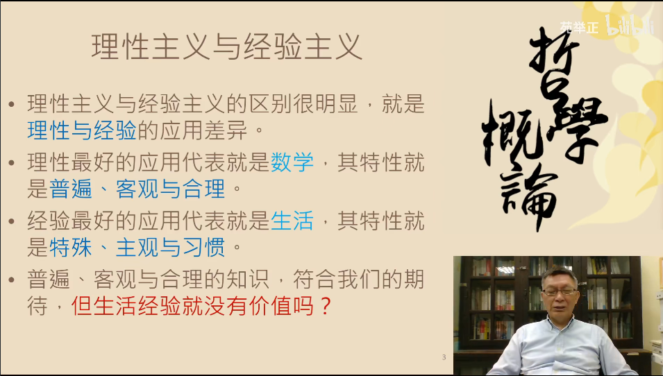

经验的价值：

1. 生活经验的价值应用特殊性就是特殊，主观与习惯
2. 特性之外可以分为内外两层：
	1. 内：内在的心灵
	2. 外：外在的世界
3. 这两部分都有普遍性和可关心，需要将其组织起来

英国经验主义的两大代表：

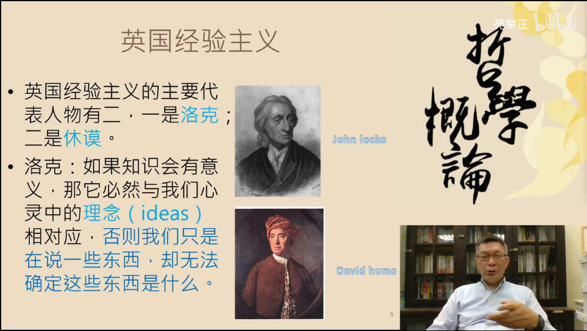

洛克提出了白板论：

> 人心中没有天赋的原则，人心如同一块白板，理性与知识都从经验而来

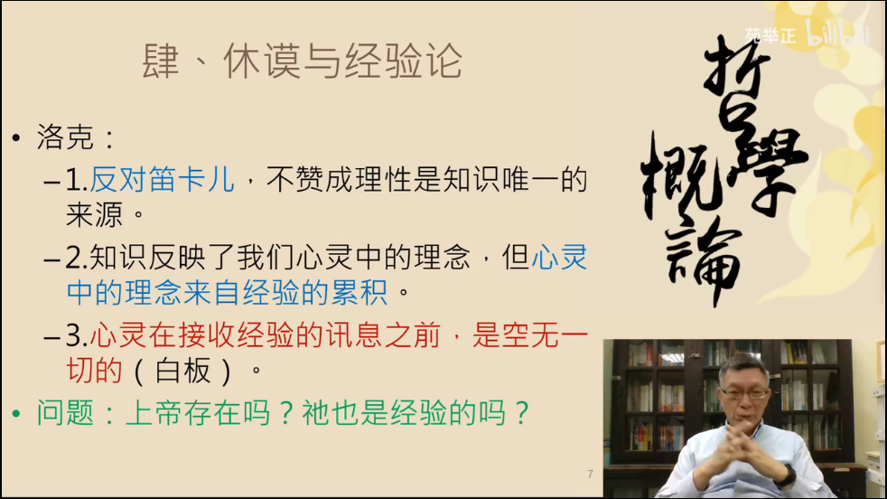

问题的理清：

1. 我们说出来的概念与心灵感知的理念存在着区别吗？
2. 当我们说上帝存在，自由意志或者灵魂不灭的时候，我们可能说出一些普遍，客观与合理的事物吗？
3. 当我们讨论“存在”的时候，我们只能够透过纯粹心灵进行分析时，这件事物的“存在”到底是什么？

休谟承袭了洛克，认为感官为主要知识的来源：

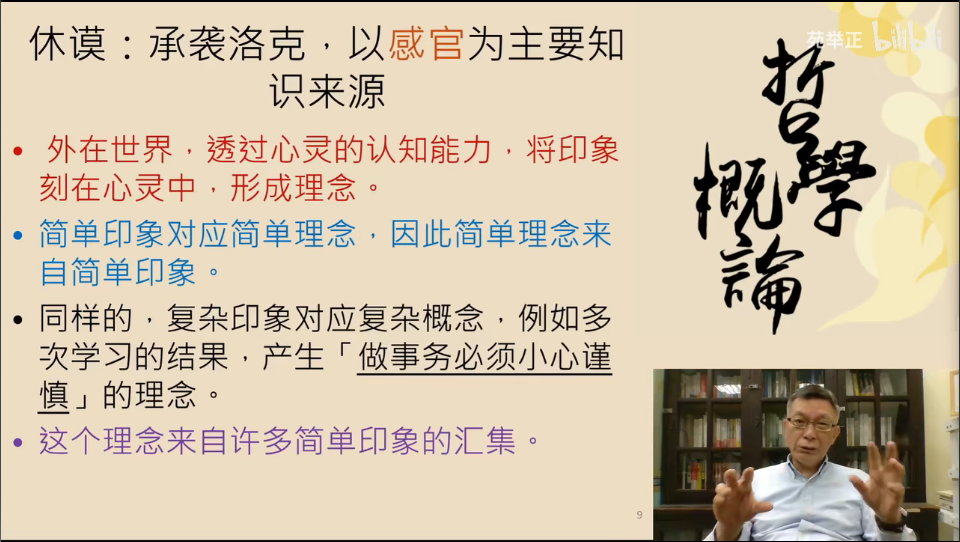

核心观念：外在的世界——>心灵的认知能力——>心灵中的印象（概念）

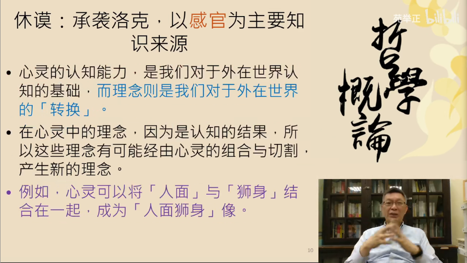

休谟经验论的总结：

1. 白板理论：心灵在观察到外在世界之前，是空无一物的
2. 拷贝理论：感官印象可以在心灵之中被拷贝成为新的概念
3. 心灵的原子理论：凡是在心灵中的理念，只要存在着内容不同者，必然是可以区分成为不同理念

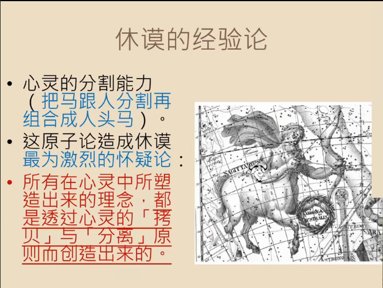

可以怀疑的对象：因果关系，自由意志，上帝存在等等

可以怀疑的原因：这些概念没有客观世界上对应的真实事物

休谟的怀疑论：

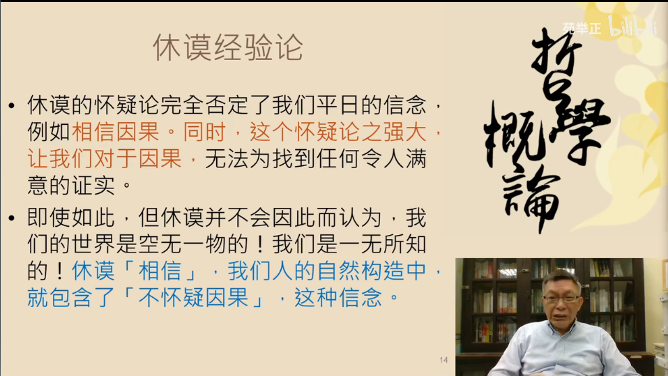

否定因果论=否定机械论=否定科学理论

康德面对的知识论挑战：

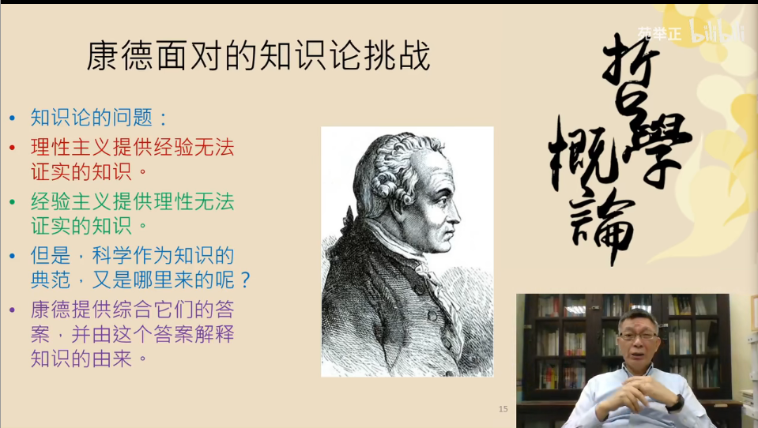

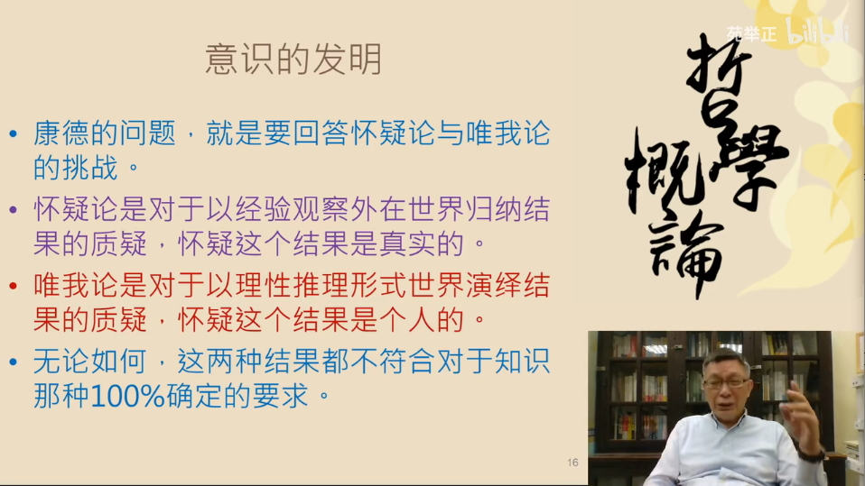

从我思考到我意识的转变：

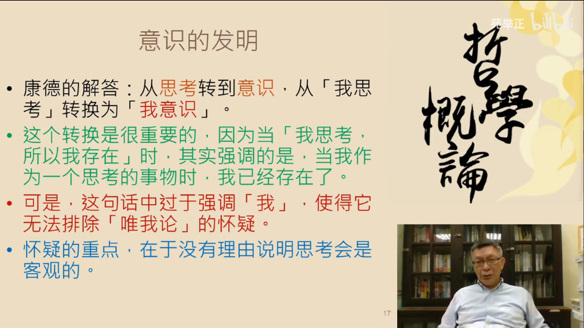

我思故我在的问题：

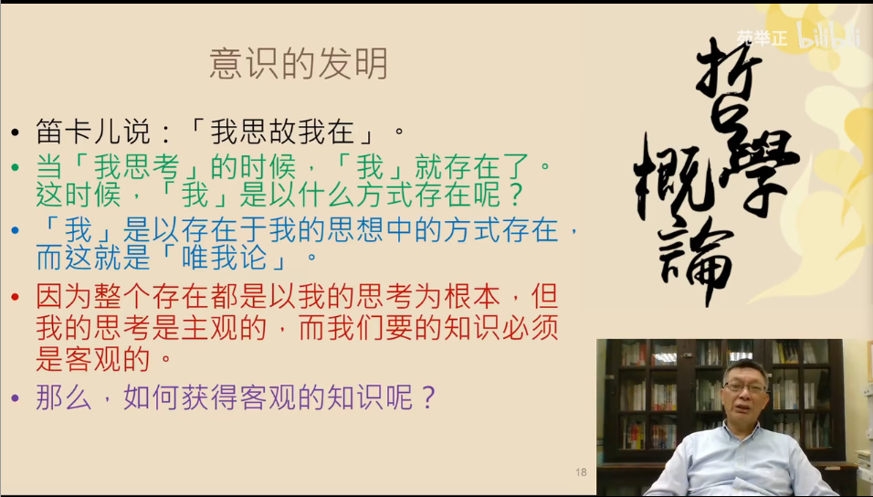

康德的回答：

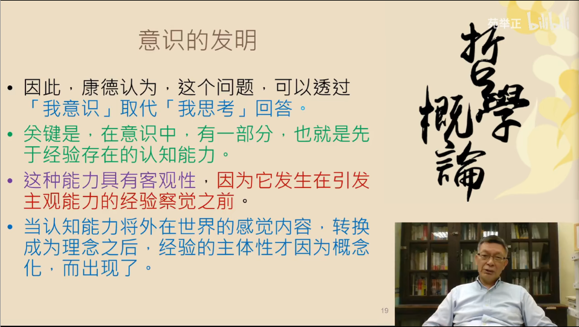

康德的有色眼镜论：

> 无论我们看到什么，首先都会被认为是时间和空间里的现象。康德把“时间”和“空间”称为‘直觉的两种形式’。他强调，我们头脑中的这两种“形式”先于一切经验。换句话说，在我们经历事物之前就已经能知道我们会把它们看作是时间和空间上的现象，因为我们无法摆脱这副理性的‘眼镜’。

**康德认为，时间和空间属于人类的条件，是我们一直用来感知世界的方式，而非物质世界的属性**

康德的结论：

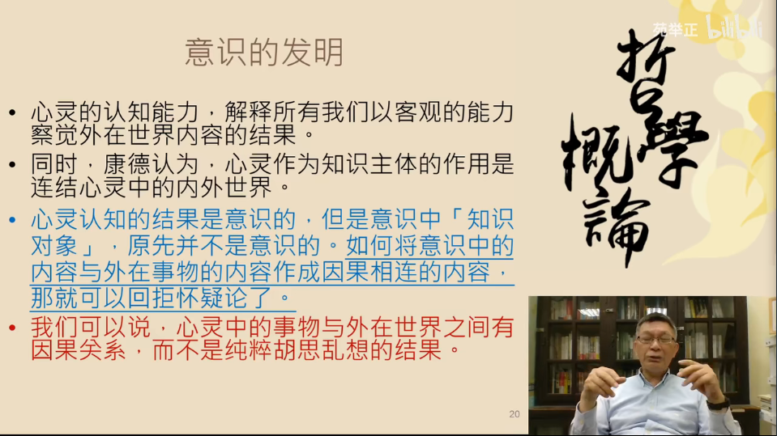

“我意识”比”我思考”优越的点：意识中所呈现的内容与思考的对象并不等同，思考的对象会因为胡思乱想而有所改变，但是意识之中所呈现出来的内容则是因为经由理念组成，在形成概念之后，是可以固定的；甚至于可以不顾外在世界的情况，经由概念的重组，形成一个整体性的认知。

意识的整体性：

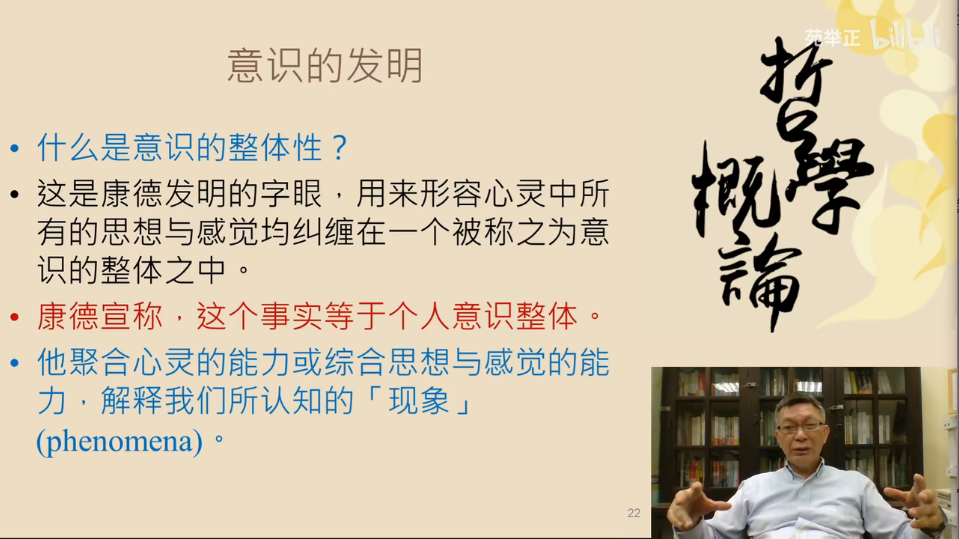

意识的整体性的由来：

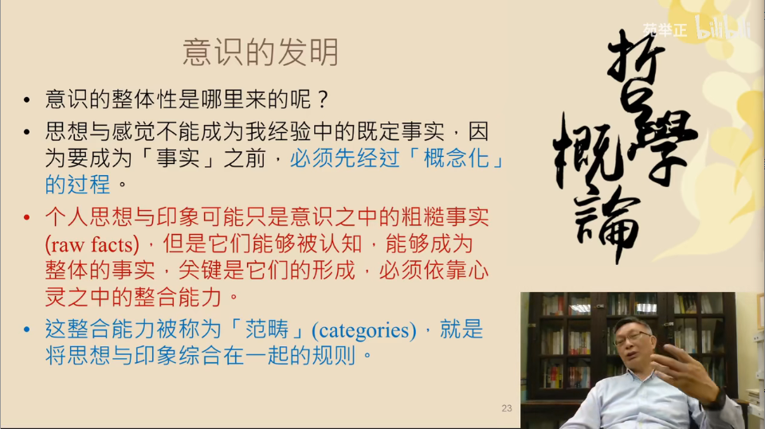

概念化：通过印象来描绘事实。

心灵之中有着整合能力，被称之为叫做范畴：

1. 质
2. 量
3. 形式
4. 关系

这四者便是将思想与印象综合在一起的规则。

人天生便具有了应用范畴的能力，而且对此的应用是情不自禁自然而然的。

康德的最终结论：

1. 我并非全然主观的拥有意识，我也综合思想与感觉，二这个综合使得客观判断成为可能
2. 我的知识必然仅是这个世界中“对我”所呈现出来的表征知识（主题的限制）

康德的理论给出了要给解决方案，但是也不是全然的能够解决问题，对于康德的理论也存在着不赞同与批判。

